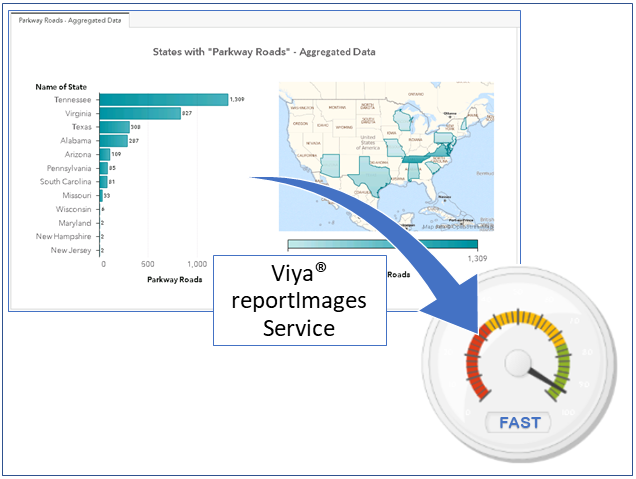

# SAS  Viya  reportImages Service: The Report Optimization Speedometer                                                                                  

SAS® Viya® offers several techniques that can maximize the speed of SAS® Visual Analytics reporting: data partitioning, user-defined formats, and using aggregated data.  However, every SAS Visual Analytics report can be different: different data, different graphs, and other differences in terms of filters, interactive widgets, and more. Testing how changes to individual reports affect speed can be laborious and might involve manually opening reports in the SAS® Report Viewer several times and meticulously reviewing each report’s diagnostics or microservice logs. Even with this information, external factors such as network performance can confound the diagnostics. This paper presents a programmatic way to call a SAS Visual Analytics report to quickly determine how long it takes the report to render using the reportImages service, available via the SAS Viya REST API. This paper provides all of the code for an automated, end-to-end process that leverages the SAS Viya REST API to retrieve the server-side render time of a SAS Visual Analytics report. Code is provided for testing an individual report on demand. This process can be repeated automatically while the report designer tests several versions of the report.  Macro code demonstrates how to test a suite of reports for comprehensive A/B comparisons. Data gathered from these repeated API calls enables designers to quickly determine the best performance techniques to meet their specific reporting needs.  

  

 

## Additional information

Find the full paper online with the [SAS Global Forum proceedings](https://www.sas.com/en_us/events/sas-global-forum/program/proceedings.html).

## Supporting Code

### All SAS code must be submitted in a SAS Studio 5.1 (or later) session within a Viya 3.4 (or later) environment which contains the SAS Viya services that are being called.

The SAS Visual Analytics Reports and SAS code examples covered in the paper can be found in this repository!

The SAS code from the paper do not have to be run on the Visual Analytics reports that are shown in the paper, rather they can be run calling ANY Visual Analytics Report by inputting the desired report’s internal UID (see the ViyaAPI_SASCode section for more details).

If you wish to replicate the paper's examples in their entirety using you can use the SAS Visual Analytics reports available in this repository.  The process for re-creating the paper’s examples is below:

1.  [Re-create the paper's data sources](./Data)
2.  [Import the SAS Visual Analytics Report Examples](./Visual_Analytics_Reports)
3.  [Run the example SAS Code](./ViyaAPI_SASCode)

#### Bonus! To assist with getting started, the following SAS code is provided which will retrieve the internal UID of a SAS Visual Analytics report
* [retrieve_VA_report_ID.sas](./retrieve_VA_report_ID.sas)

## Support contact(s)

Michael.Drutar@sas.com                                                                                                                                                                                                                                                                                                                                                                                       
